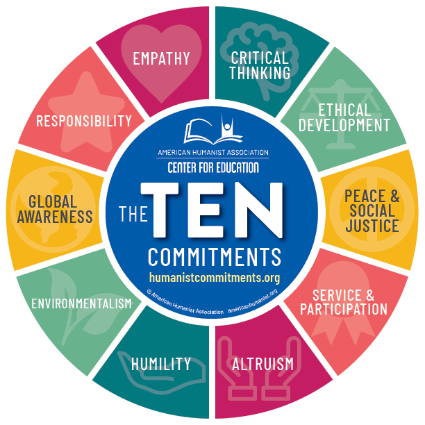

# how-to-communicate-with-your-professors

Finally, I decided to create this Git Repo after repeatedly and, admittedly, with some frustration, reminding my students (Undergraduate, Masters, and Ph.D.) about the importance of improving communication and practicing basic (email) etiquette. I did use ChatGPT to polish my draft, which is good, as it may tone down some of my original language. 😃

This is not the Ten Commitments, which are great, by the way: 

### Guidelines

#### 1. **Be Responsive**
Please respond promptly when I email you. For instance, if I send an email like:  
> _"A, please come by my office next Tuesday at 10 AM to discuss your progress on Project X."_  

A polite and expected response would be:  
> _"Professor Li, I will be there."_  

Unfortunately, I often receive no response at all. If you are Student A, imagine how I feel on the following Monday or Tuesday morning:  
- Did the student receive my email?  
- Will he/she show up?  

Especially if you are a new student and have not yet earned my trust, acknowledging receipt of the email is crucial. Completing this "handshake" protocol helps build mutual trust. After receiving your email, I can confirm by:  
> _"Great. See you then."_  

Please note that I do not expect you to respond within 20 minutes or even two hours. The general expectation is to reply within one business day. For my Ph.D. students, however, my ``actual expectation" is to respond by the end of the same day.

#### 2. **Be Respectful**
Starting your email with a proper salutation like _"Professor Li"_ or _"Dear Dr. Li"_ is always a good practice. Unfortunately, I often see emails without any salutation. Respectful communication reflects professionalism.

#### 3. **Be On Time**
Punctuality is critical. Unless there are extraordinary circumstances, you should never be late to a meeting. Remember:  
> _"If you are early, you are on time. If you are on time, you are late. If you are late, you are fired."_  

If something unavoidable happens (e.g., traffic), inform me via email or text that you may be late. While this is not ideal, it is far better than saying nothing and showing up late. Think about how you would handle a job interview—would you plan to arrive early or gamble on things going smoothly?

#### 4. **Give Files Descriptive Names**
Avoid sending attachments with generic names like `file1.pdf`, `a.pdf`, or `123.pdf`. Instead, use a clear and descriptive naming convention such as:  
> _"Report_Project_X_YOUR LAST NAME_mmddyy.pdf"_  

#### 5. **Avoid Last-Minute Cancellations**
While I may very rarely need to cancel a meeting on short notice, you should not do this to your professors unless it’s due to extraordinary circumstances. Respecting the schedule is a key part of professional etiquette.

#### 6. **Come Prepared**
I maintain an open-door policy for my students and welcome pop-ins if I’m not in the middle of a meeting. However, for planned discussions (e.g., with your dissertation committee member, Professor Y), I suggest requesting a meeting a few days in advance. 

- **Be concise:** Briefly state the purpose of the meeting in your email; avoid sending lengthy messages.  
- **Provide context:** If you want to discuss a model or project, attach relevant materials with explanations. Do not send raw data or models without context or results.  
- **Prepare materials:** On the day of the meeting, bring a hard copy of your work if possible. Alternatively, email your updated results or presentation slides beforehand.  
- **Avoid unprepared meetings:** Do not request a meeting without preparation, as it is unproductive for both parties.

#### 7. **Keep Me in the Loop**
If you attend a meeting with a sponsor or collaborator that I could not join, please ensure I am updated. This can be done by scheduling a time to meet with me in person or by emailing a brief summary or meeting minutes. 

#### 8. **When to Reply All and When Not?**
This can be tricky and requires judgment. Sometimes, I will explicitly state in the email, "please reply all." Other times, you will need to determine the appropriate action. 

For example:  
- In an email thread involving a project with several collaborators, if you have a technical question that only pertains to our internal group, **do not reply all.** Instead, email just our internal team members.  
- Conversely, if your response is relevant to everyone involved in the thread, replying all ensures clear communication and avoids unnecessary follow-ups.

When in doubt, consider whether everyone in the email thread needs to see your response. If not, narrow your recipients accordingly.

#### 9. **Do not make the same mistake**
If you make a mistake and I help you correct it, try not to repeat the same error. For instance, in LaTeX, one should use ``some text'' instead of "some text" to ensure proper quotation formatting. Saddly, I have to do this for a paper, just hours ago. 

- Here is [a general guide for a GitHub repo](how_to_git_repo.MD)

#### 10. **A Deadline Means a Deadline**
Meeting deadlines is one of the most critical traits I expect my students to develop. Do not ask for an extension just hours before the deadline, nor request a few extra hours—it raises questions about the quality of work you could produce in such a short time.

Building a good reputation takes weeks, months, or even years, but it can be damaged in a single instance when you fail to meet expectations. You will no longer be seen as someone **"who delivers on time."** As I often say, everyone starts with a 100% ``trust score.`` Each instance of missed expectations reduces that score, and it is incredibly difficult, if possible at all, to regain a perfect score once it has been diminished.

**Do not wait till the last minute**

